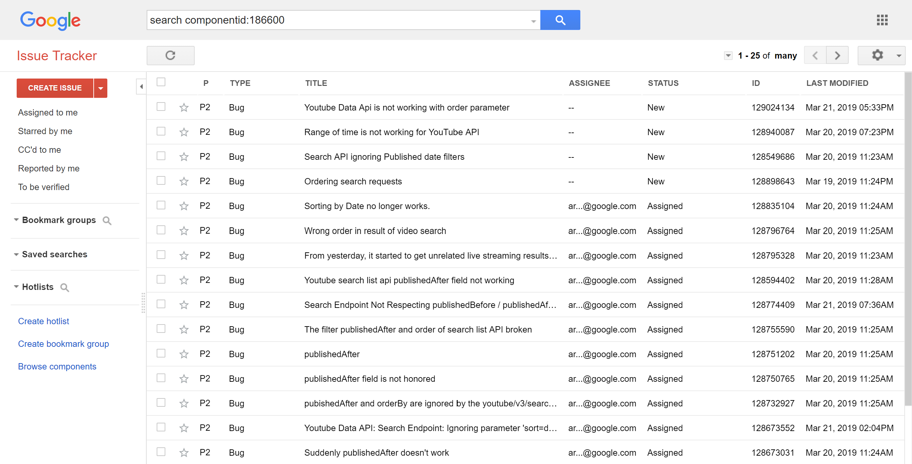

# YouTube to Outlook Calendar

A "does work" script that grabs YouTube Live Broadcast information (from past, now, and future) and puts into your Outlook Calendar.

I created this for my [vtuber-calendar](https://github.com/yume-chan/vtuber-calendar) project, as fully manually maintenance costs too much time.

THIS README IS A PIECE OF JUNK!

I know, but I don't have the mood to rewrite it because of the rubbish YouTube Data API v3.

## Usage

### Step 1: create a configuration file

Create a file called `config` at the root directory, with any file extension that can be `import`ed, including `js`, `ts` and `json`.

In the config file, export an object that comforms to the `Config` interface defined in `src/config.ts`.

Here is a minimal example for `config.json`:

```json
{
    "googleApiKey": "<INSERT YOUR KEY HERE>",
    "youtubeChannels": [
        {
            "id": "UCn14Z641OthNps7vppBvZFA",
            "nickname": "千草はな"
        }
    ],
    "outlookCalendarName": "Vtuber"
}
```

(Yes, I'm a huge fan of Chigusa Hana, a kawaii virtual youtuber).

Check the comments in `src/config.ts` for detailed description.

### How to get the Google API Key?

Please google it.

### Note for API Quota

New projects created nowadays only have 10,000 points of quota for YouTube Data API v3 per day.

When each `youtube.search.list` API call costs 100 points (for only 50 results) and each `youtube.video.list` API call costs 5 (or maybe any other number, I don't really care) points per video, it will blow up your quota limit very very quickly.

So use with your own judgement.

### Fix your API ASAP, Google!

In theroy we can record the last updated time any only search for new events after that.

But sadly, all filters in `youtube.search.list` API are currently not functional


[source](https://issuetracker.google.com/issues?q=search%20componentid:186600)

And Google says they did it for ["remove graphic, violative content from YouTube"](https://support.google.com/youtube/thread/2494861).

I don't understand what's the relation between the two, but I know you have to request full data everytime so it blows up your quota even more quickly.

### Want unlimited YouTube Data API v3 Quota?

Luckily, I have found a way to abuse the API Key from Google API Explorer. It's very simple, and you will get literally INFINITE quota.

But I don't want to publish it here.

You may still reach the so called "per user quota", changing your IP address will "fix" it.

### Step 2: get your Microsoft Graph Access Token

To access your Outlook Calender, we need an access token for your Microsoft Account.

1. Run

    ```shell
    npx http-server -p 3000 www
    ```

    in your terminal.

    DONNOT change the port! That's important.

2. Open `http://localhost:3000` in your browser.

3. For the first time you open this page, click the <kbd>login</kbd> button. A popup will appear that let you log into your Microsoft Account.

4. Click the <kbd>auth</kbd> button, another popup might appear (or maybe not, I'm not sure) that let you authorize my app to access (read and write) your Outlook Calendar.

5. Anyway, after that, the webpage should only contains some garbage text (not truly garbage, technically).

6. Select All, Copy, and Paste into `www/token.txt`

   PS1. Create it if not exist.
   PS2. To be more clear, put it besides the `index.html` file.

7. You can close your browser and terminal as you wish.

### Refresh your access token

If you see error says can not authenticate with the access token, repeat the steps above.

The only differences is that you can skip clicking the <kbd>login</kbd> button first, and the <kbd>auth</kbd> button should not have any popups appears.

### Do the work

1. Run

    ```shell
    npx ts-node src/index
    ```

    in your terminal.

2. Sit back and pray that no errors will occur.

Yes, I love TypeScript, and I don't want compiling, so the awesome `ts-node` project is always my best saver.
